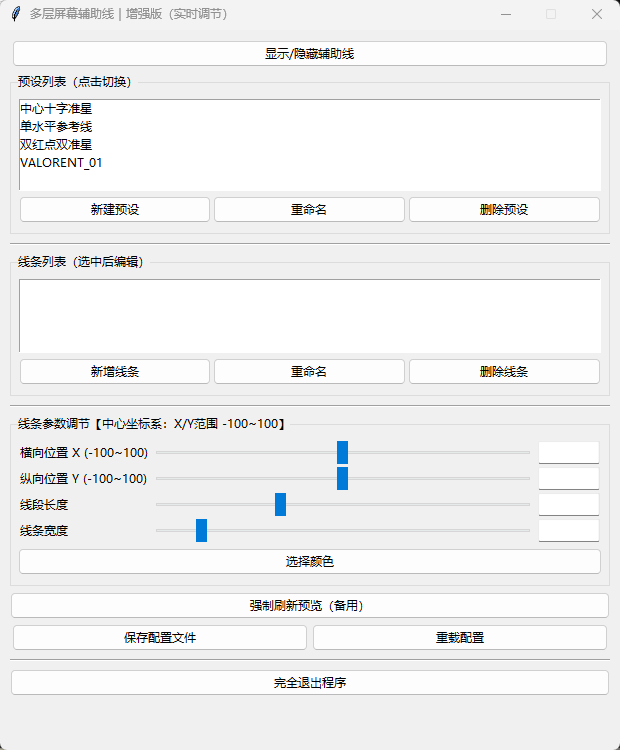

# TL_Crosshair

打瓦的时候记几个手雷点位的时候没找到舒服的外置准星软件，
所以就有了这个。

## 使用前置
- 需要安装 Python

## 使用方法
- 直接用 Python 运行即可

## 可以实现的功能
- 生成指定数量、位置、宽度、长度、角度的线段
- 实时调节
- 保存配置

**注意：** 为了防止不小心关闭，关闭按钮只会最小化窗口。可以使用最下方的“完全退出程序”按钮退出。

## 软件面板截图

## 祝大家游戏愉快
